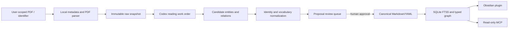

# PaperKG integrated blueprint

## Outcome

PaperKG combines three systems while keeping one canonical store:

1. an evidence-preserving scholarly database;
2. a typed, temporal knowledge graph for problems, methods, benchmarks,
   results, claims, and limitations;
3. a human/AI research workspace for search, comparison, review, and idea
   generation.

| Layer | Responsibility | Canonical? |
| --- | --- | --- |
| Obsidian Markdown + YAML | approved notes, evidence, vocabulary, relations | Yes |
| SQLite FTS5 + graph tables | exact, lexical, filtered, and multi-hop retrieval | No; rebuildable |
| Obsidian plugin + MCP | human UI and model-facing tools | No; interface only |

The governing rule is: do not turn every sentence into a node. Promote an
entity when it is reused across papers, independently searchable, temporal or
versioned, or when the relationship needs its own evidence and properties.

## End-to-end flow

External paper text is untrusted data. It may contain strings that resemble
instructions; those strings never control Codex, the CLI, the plugin, or MCP.

## Competency questions

The system is accepted only if it can answer:

1. What are a work's versions, venue, and public dates?
2. How does each version frame the research problem and claim contribution?
3. Which papers use a benchmark, for what purpose, and under which protocol?
4. Which reported results are actually comparable?
5. Which papers share a normalized limitation?
6. How did a problem framing change over time?
7. Did later work address, partially address, reopen, or leave a limitation open?
8. Which source passage, table, or figure supports a claim or relation?
9. What changed between arXiv and venue versions?
10. Which method–benchmark combinations or repeated limitations remain uncovered?

## Delivery phases

- Phase 1: schema, templates, parser, validator, fixture vault.
- Phase 2: metadata and identity resolution.
- Phase 3: local PDF parsing and Codex proposal review.
- Phase 4: SQLite FTS5, graph traversal, ranking, evidence packages.
- Phase 5: Obsidian research workspace.
- Phase 6: read-only MCP and proposal interfaces.
- Phase 7: research-gap reports and human-approved ideas.

All phases are present in this repository. Optional infrastructure such as a
Any secure tunnel or hosted MCP endpoint is configured separately. No paper
metadata, document-analysis, or AI extraction API is part of PaperKG.
