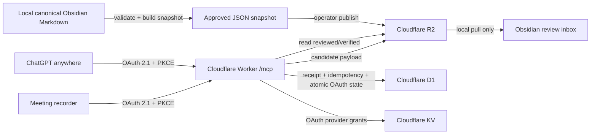

# Cloudflare hosted PaperKG deployment

## Production result

The supported user path is a public Cloudflare Worker, not a local MCP process.

```text
Base URL:  https://paperkg-remote.nhtgb021030.workers.dev
MCP URL:   https://paperkg-remote.nhtgb021030.workers.dev/mcp
Health:    https://paperkg-remote.nhtgb021030.workers.dev/health
Meeting:   https://paperkg-remote.nhtgb021030.workers.dev/mcp/v1/meeting-ingestions
```



The Worker does not mount Google Drive and cannot edit canonical Markdown. This preserves `vault/PaperKG/**/*.md` as the only source of truth while allowing ChatGPT access from any device.

## Provisioned resources

| Resource | Name/binding | Purpose |
| --- | --- | --- |
| Worker | `paperkg-remote` | MCP, OAuth provider, protected meeting API |
| KV | `OAUTH_KV` | OAuth provider grants and provider-managed non-transactional state |
| R2 | `paperkg-storage` / `PAPERKG_STORAGE` | approved snapshot and untrusted meeting candidates |
| D1 | `paperkg-remote` / `PAPERKG_DB` | meeting receipts, ownership, idempotency, and ten-minute single-use OAuth consent/upstream state |

Configuration is in `apps/cloudflare-worker/wrangler.jsonc`. D1 migrations are in `apps/cloudflare-worker/migrations`.

## OAuth model

The Worker is the OAuth authorization server seen by ChatGPT and the meeting app. GitHub is used only to authenticate the vault owner. The Worker issues its own audience-bound MCP access and refresh tokens.

### ChatGPT/Codex account switching

PaperKG is deliberately not bound to one OpenAI account. Each ChatGPT or Codex
connection is an independent OAuth client with its own access and refresh
tokens. Dynamic client registration and Client ID Metadata Documents allow a
new OpenAI account or workspace to establish that independent connection.

The durable PaperKG identity is the allowlisted GitHub user ID returned after
the owner signs in. Consequently, reconnecting from another OpenAI account with
the same allowed GitHub identity reaches the same reviewed snapshot and the same
owner-scoped meeting receipts. It does not copy or migrate an old OpenAI token.

To switch accounts:

1. Leave Obsidian, Zotero, Cloudflare, R2, D1, and the canonical vault unchanged.
2. In the new ChatGPT account/workspace, enable developer mode if its plan and
   role expose custom apps.
3. Create a new OAuth app connection to
   `https://paperkg-remote.nhtgb021030.workers.dev/mcp`.
4. Scan tools and approve PaperKG with the same allowlisted GitHub account
   (`inharlans`).
5. Test `search` with `A-MEM`, then `get_paper` and `compare_papers`.

The old and new OpenAI-account connections are isolated at the OAuth client and
token layer. Disconnecting one does not delete the canonical vault or invalidate
the other. If the old account was compromised rather than merely quota-limited,
disconnect or revoke its PaperKG connection separately.

Run the following read-only diagnostic before or after an account switch. It
does not register a client, issue a token, or mutate Cloudflare state:

```powershell
pnpm cloudflare:check-account-switch
```

- authorization endpoint: `/authorize`
- token endpoint: `/oauth/token`
- revocation endpoint: published automatically by the Cloudflare OAuth provider
- dynamic client registration: `/oauth/register` for compatibility
- client ID metadata documents: enabled
- PKCE: S256 only; plain PKCE and implicit flow are disabled
- canonical resource/audience: `https://paperkg-remote.nhtgb021030.workers.dev/mcp`
- owner allowlist: GitHub login `inharlans`

Scopes:

| Scope | Capability |
| --- | --- |
| `paperkg.read` | approved metadata, summaries, graph queries |
| `paperkg.evidence.read` | approved note body/evidence text |
| `paperkg.meeting.submit` | submit and inspect the signed-in owner's meeting candidates |

There is no remote canonical-write or approval scope. GitHub access tokens are used transiently for identity lookup and are not stored in PaperKG OAuth props.
When the login allowlist is configured, the upstream GitHub authorization asks
for no additional account scope. An email-only allowlist requests only
`user:email`. After identity lookup, the Worker uses GitHub's OAuth App owner
endpoint to revoke the individual upstream token. Revocation failure is logged
without token material and does not invalidate the already-verified identity.
This five-second-bounded cleanup runs through `waitUntil`, so GitHub revocation
latency cannot delay the final PaperKG authorization redirect.

Consent and upstream GitHub state are written to D1 and consumed with one write-routed `DELETE ... RETURNING` statement. This avoids Cloudflare KV's cross-location read-after-write delay, prevents a read-first D1 batch from being routed through a stale replica, enforces single use, and treats expired rows as invalid. Scheduled cleanup removes abandoned rows.

The Worker has an hourly `0 * * * *` Cron Trigger. It invokes the OAuth
provider's own expiry purge and removes expired transient state, callback audit,
reissue authorization, completed-redirect recovery rows, and unfinished meeting
storage reservations older than 24 hours. Stale meeting cleanup first claims a
row in D1, then deletes its deterministic R2 objects, and removes the D1 row
only after R2 succeeds. Defining a
`scheduled()` handler without this trigger is not sufficient in production.
Each cleanup runs independently with a non-secret structured outcome log, so a
temporary failure in one store cannot skip or mask the remaining cleanup work.

The consent POST uses a single HTTP `303` redirect to GitHub. It deliberately has no HTML meta-refresh or second manual navigation link, so one browser action cannot race two upstream authorization navigations. D1 retains 24 hours of non-secret callback phase events keyed only by a truncated hash of the random state; authorization codes, access tokens, redirect URLs, GitHub identity, and user content are never recorded.
The host-only CSRF cookie is expired as soon as the consent POST leaves for
GitHub, and a new consent page also expires any binding cookie left by an older
flow. Every terminal OAuth success, recovery, validation failure, identity
denial, and callback failure response is non-cacheable and expires both the
CSRF and browser-binding cookies. They are never reused as a long-lived login
session.

The consent page's Content Security Policy allows form navigation only to the Worker itself and `https://github.com`. GitHub must be included because browsers apply `form-action` to the POST redirect chain; a self-only policy consumes the consent state but blocks the external OAuth navigation.

After authorization completion, the exact provider-generated final redirect is AES-256-GCM encrypted with a dedicated Worker secret and retained in D1 for at most ten minutes under the browser-binding hash. `/oauth/resume`, a duplicate completed callback, or a duplicate consent POST may atomically consume that record and issue the same redirect once. The provider's authorization code remains single-use, and plaintext codes or redirect URLs are never stored in D1. `/health` performs an in-memory encrypt/decrypt self-check and reports `oauthRecovery: ready` without exposing key material. It also reports `githubOAuth: ready` only when the GitHub client credentials and at least one owner allowlist identity are configured. A primary-consistent D1 check reports `meetingStorage: ready`, `backlog`, or `unavailable`; only unfinished meeting receipts older than the 24-hour cleanup boundary count as a backlog, and no count, receipt ID, or timestamp is exposed. The top-level `ok` requires all three checks to be ready, while no credential or allowlist value is returned.

Callback auditing and encrypted redirect recovery are optional reliability
layers after authorization succeeds. Their storage failures are logged with
non-secret structured metadata but cannot replace a valid provider redirect
with an OAuth error. Core state and code consumption remain fail-closed.

The public OAuth mutation routes are guarded before the provider parses their
bodies. `/authorize`, `/oauth/register`, `/oauth/reissue-loopback`, and
`/oauth/token` accept at most 64 KiB; the exact `/mcp` protocol endpoint accepts
at most 1 MiB. The separately streamed meeting-ingestion route retains its
12 MiB envelope limit. Oversized chunked requests receive a non-cacheable
`413` without reaching JSON or form parsing. A Cloudflare Rate Limiting binding
allows at most 10 DCR attempts per minute and 30 consent/token/reissue attempts
per path per minute in each Cloudflare location. These permissive,
eventually-consistent counters are a resource-exhaustion defense layer, not an
authorization or billing source of truth. Binding failures fail closed with a
non-cacheable `503`, a bounded `Retry-After`, and non-secret structured logs.

An operator-only emergency path, `POST /oauth/reissue-loopback`, can recover a still-live desktop PKCE transaction when the browser loses the final loopback navigation. It accepts only the exact registered `127.0.0.1` callback path, MCP resource, and meeting-submit scope; requires a short-lived D1 preauthorization for the SHA-256 hash of the complete request; atomically consumes that authorization; and matches an existing unredeemed owner grant before minting a replacement single-use code. It is not a general client retry API and never records raw state, verifier, code, or redirect URL in D1.

## Complete the GitHub OAuth secret setup

The GitHub OAuth App must use:

```text
Application name: PaperKG Remote MCP
Homepage URL: https://paperkg-remote.nhtgb021030.workers.dev
Callback URL: https://paperkg-remote.nhtgb021030.workers.dev/callback
```

Run this in an interactive PowerShell. Paste values only into Wrangler's hidden prompts; do not put them in chat, source files, `.env`, or shell history.

```powershell
cd 'C:\Users\user\Documents\knowloge graph'
pnpm cloudflare:set-oauth-secrets
```

The script stores `GITHUB_CLIENT_ID` and `GITHUB_CLIENT_SECRET` as encrypted Cloudflare Worker secrets.

## Publish reviewed knowledge

Publishing is deliberately one-way and explicit:

```powershell
cd 'C:\Users\user\Documents\knowloge graph'
pnpm cloudflare:publish
```

This command:

1. validates `vault/PaperKG`;
2. reads only `reviewed` and `verified` Markdown notes;
3. strips local/private path fields;
4. builds `.paperkg/cloudflare/paperkg.snapshot.json`;
5. uploads it to `paperkg-storage/snapshot/paperkg.snapshot.json`.

SQLite, Zotero data, Google credentials, private PDFs, candidate notes, and unreviewed extraction proposals are not published.
The snapshot builder recursively removes local/file/PDF/attachment/Drive paths,
Zotero item and attachment keys, subject/idempotency hashes, and any metadata
key ending in `_token` or `_secret`. Public scholarly identifiers such as DOI,
arXiv, and OpenReview IDs remain available.

## Deploy and verify

```powershell
pnpm --dir apps/cloudflare-worker typecheck
pnpm --dir apps/cloudflare-worker build
pnpm cloudflare:deploy
```

Expected checks:

- `/health` returns `200`, top-level `ok: true`, and `meetingStorage: ready`.
- unauthenticated `/mcp` returns `401` with `WWW-Authenticate` and path-specific protected-resource metadata.
- OAuth authorization-server metadata names `/authorize`, `/oauth/token`, and `/oauth/register`.
- authenticated tool listing exposes only read-only PaperKG tools.
- a meeting token without `paperkg.meeting.submit` receives `403`.
- oversized chunked meeting bodies are stopped during streaming and receive `413`.
- oversized OAuth and exact MCP protocol bodies are stopped before provider parsing and receive `413`.
- unit tests cover DCR/OAuth rate-limit `429`, fail-closed binding errors, and body preservation below the limit.
- production dependency audit reports no known vulnerability.

## Connect in ChatGPT

Current OpenAI authentication guidance is maintained in [Authenticate users](https://developers.openai.com/plugins/build/auth).

1. In ChatGPT web, enable Developer mode under Settings/Workspace Settings → Apps.
2. Choose Apps → Create.
3. Enter `https://paperkg-remote.nhtgb021030.workers.dev/mcp` as the remote MCP endpoint and select OAuth.
4. Choose Scan Tools, approve the PaperKG consent screen, and sign in with the allowlisted GitHub account.
5. Create the draft app and test `search`, `fetch`, `get_paper`, and `compare_papers` in a new chat.

Availability depends on the ChatGPT plan and workspace role. As of 2026-08-12, full MCP apps are available on Business and Enterprise/Edu web workspaces; Pro supports developer-mode read/fetch connectors. ChatGPT custom MCP apps are web-only. After tool schema changes, refresh/review the app because ChatGPT keeps a frozen approved tool snapshot.

## Cost boundary

PaperKG performs no OpenAI, Anthropic, DeepL, or other model API calls in the Worker. Cloudflare charges, if any, are limited to Worker requests and KV/R2/D1 usage. Paper extraction and normalization remain a local Codex curation task performed only for papers the user selected.

## Recovery

- Canonical recovery source: `vault/PaperKG/**/*.md` plus its normal backups.
- Derived snapshot recovery: rerun `pnpm cloudflare:publish`.
- D1 recovery: export meeting receipts; they are not canonical facts.
- R2 meeting candidates can be downloaded again until deliberately removed.
- Never restore knowledge by editing D1, KV, or the snapshot JSON directly.

Implementation references: [Cloudflare remote MCP](https://developers.cloudflare.com/agents/model-context-protocol/guides/remote-mcp-server/), [Cloudflare MCP authorization](https://developers.cloudflare.com/agents/model-context-protocol/protocol/authorization/), and [Workers OAuth Provider](https://github.com/cloudflare/workers-oauth-provider).
